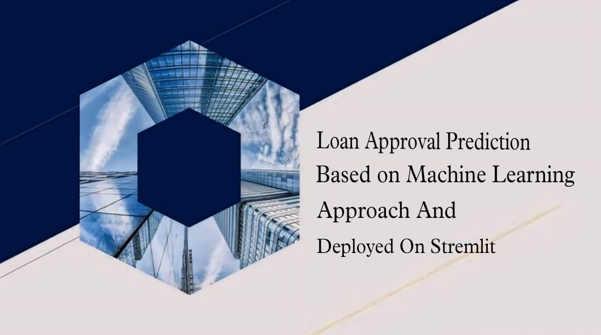

**Project Overview**

This project is designed to streamline the loan application process and offer users a quick and accurate assessment of their loan eligibility. By allowing users to input details such as income, credit score, and employment history, the application leverages machine learning models, to determine loan eligibility.

In this project, several machine learning algorithms were tested to find the best-performing model:

Here the Machine Learning Algorithms Used with there accuracy

K-Nearest Neighbors (KNN): 0.9005
Logistic Regression: 0.9110
Gaussian Naive Bayes: 0.9192
Support Vector Classifier (SVC): 0.9297
Random Forest: 0.9789
Decision Tree: 0.9848
XGBoost: 0.9848
After evaluating the performance of these algorithms, Decision Tree was chosen as the final model for its superior accuracy.

Key Features:
Streamlined Loan Application: Simplifies the loan application process for users.
Automated Decision-Making: Assists financial institutions in automating loan decisions.
Machine Learning Models: Uses advanced models to provide accurate predictions.
User-Friendly Interface: Developed with Streamlit for an intuitive user experience.
This application aims to help both prospective borrowers and financial institutions by leveraging machine learning to make data-driven loan decisions.

You can access the deployed application using the following link:

[Loan Approval Predicting App](https://loan-prediction-app-ocwdo9mchdg4k9v45dw8bz.streamlit.app/)
To run a Streamlit application, follow these steps:

1. **Install Streamlit:**

   If you haven't already installed Streamlit, you can do so using pip (Python package manager):

   ```
   pip install streamlit
   ```
## Installation

To install the required dependencies, ensure you have `pip` installed and then run:

```sh
pip install -r requirements.txt

2. **Create Your Streamlit App:**

   Write your Streamlit app code in a Python script (e.g., `my_app.py`). You can use any text editor or integrated development environment (IDE) of your choice.

   Here's a simple example of a Streamlit app:

   ```python
   # my_app.py
   import streamlit as st

   st.title('My First Streamlit App')
   st.write('Hello, Streamlit!')
   ```

3. **Run Your Streamlit App:**

   Open your terminal or command prompt, navigate to the directory where your `my_app.py` is located, and run the following command:

   ```
   streamlit run my_app.py
   ```

   Replace `my_app.py` with the name of your Streamlit app script.

4. **Access Your App:**

   After running the command, Streamlit will start a local development server and provide a URL (usually http://localhost:8501) where you can access your app in a web browser.

5. **Interact with Your App:**

   Your Streamlit app will now be running in your browser. You can interact with it as you would with any web application. Streamlit will automatically update the interface as you make changes to your code.

6. **Exit the App:**

   To stop the Streamlit app, simply close the terminal or command prompt where it's running.

Streamlit provides a simple and intuitive way to create data-driven web applications using Python. You can further enhance your app by adding widgets, charts, data visualizations, and more to make it interactive and informative. Refer to the Streamlit documentation (https://docs.streamlit.io) for detailed information on building and customizing Streamlit applications.
